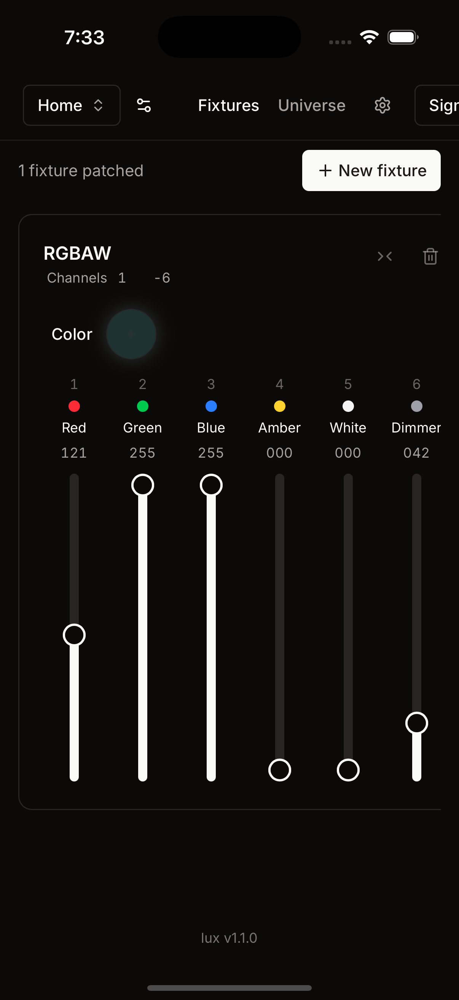

# Lux

DMX stage lighting control for Mac and iPhone, built as a native [Tauri](https://tauri.app) app: a Rust core that talks to the hardware and a Vite + TanStack Router + shadcn/ui front end to drive it. Lux runs a full 512-channel DMX universe with user-defined fixtures, patched into named setups (home / church / work) that sync to your account and work offline.

Output goes to an [Enttec OpenDMX USB](https://www.enttec.com/product/dmx-usb-interfaces/open-dmx-usb/) interface or network DMX over sACN / Art-Net (nodes auto-discovered). Control comes from the app in front of the rig, from another of your signed-in devices — a phone on cellular drives the lights at home over an outbound-only AWS IoT connection, with presence so you know something is listening — or from a Discord bot.

The Rust side keeps the universe continuously synced to the hardware (`apps/desktop/src-tauri/src/{buffer,channels,sync}.rs`) behind a device abstraction (`apps/desktop/src-tauri/src/devices/`); the UI talks to it over [tauri-typed-ipc](https://github.com/johncarmack1984/tauri-typed-ipc) (a type-safe IPC crate I wrote), so the Rust↔TypeScript command layer is type-safe end to end. The desktop↔cloud wire is typed the same way: both sides share one contract crate (`crates/lux-wire`), golden-tested so schema drift fails CI. More in [docs/ARCHITECTURE.md](docs/ARCHITECTURE.md).

## Get it

- **App Store (iPhone, iPad, Mac):** [lux for dmx](https://apps.apple.com/app/id6788795353)
- **Direct download (macOS):** signed + notarized `.dmg` from the [latest release](https://github.com/johncarmack1984/lux/releases/latest), with in-app updates
- **Web:** [lux.johncarmack.com](https://lux.johncarmack.com)

## Demo


*Setting fixture color live from the desktop UI: the RGBAW tube and the Enttec OpenDMX USB interface (bottom) respond in real time.*

## Stack

Rust · Tauri 2 · tauri-typed-ipc (type-safe IPC) · Vite · TanStack Router · React 19 · shadcn/ui ·
Tailwind v4 · Enttec OpenDMX USB (DMX512 over serial) · sACN / Art-Net (network DMX) ·
AWS (Cognito · DynamoDB · IoT Core · Lambda), managed with Terraform

## Run it

```bash
cd apps/desktop
bun run tauri dev
```

## Features

- Full 512-channel universe: user-defined fixtures, patching, role-aware color mixing
- Enttec OpenDMX USB output, plus network DMX over sACN and Art-Net (nodes auto-discovered)
- Continuous DMX512 render/sync loop with correct break / mark-after-break framing
- Named setups, cloud-synced per account, offline-first — other devices pick up changes live over an open IoT WebSocket (nudged pull)
- Remote control between your own devices: a signed-in phone anywhere drives the rig at home, presence-aware and last-write-wins, with no ports opened at the house
- Remote control from Discord over AWS IoT
- Type-safe Rust↔TS commands via tauri-typed-ipc
- Signed, notarized, self-updating macOS releases; the same pipeline ships the iOS and Mac App Store builds

## On iPhone

Same app, same universe, same setups — signed in, it also runs the rig at home from anywhere.


