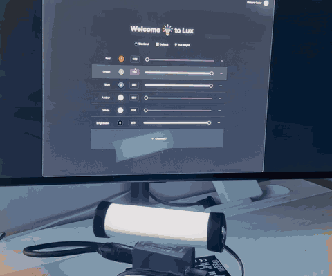

# Lux

A desktop app for driving DMX stage lighting, built as a native
[Tauri](https://tauri.app) app: a Rust core that talks to the hardware and a
Next.js + shadcn/ui front end to drive it. Lux controls an
[Enttec OpenDMX USB](https://www.enttec.com/product/dmx-usb-interfaces/open-dmx-usb/)
interface two ways — directly from the desktop UI, and remotely from a Discord
bot over AWS IoT.

The Rust side keeps a DMX channel buffer continuously synced to the hardware (`apps/desktop/src-tauri/src/{buffer,channels,sync}.rs`) behind a device abstraction (`apps/desktop/src-tauri/src/devices/`); the UI talks to it over **[tauri-typed-ipc](https://github.com/johncarmack1984/tauri-typed-ipc)** — a type-safe IPC crate I wrote — so the Rust↔TypeScript command layer is type-safe end to end.

## Demo



*Setting fixture color live from the desktop UI — the RGBAW tube and the Enttec OpenDMX USB interface (bottom) respond in real time.*

## Stack

Rust · Tauri 2 · tauri-typed-ipc (type-safe IPC) · Next.js 16 · React 19 · shadcn/ui ·
Tailwind v4 · Enttec OpenDMX USB (DMX512 over serial)

## Run it

```bash
cd apps/desktop
bun run tauri dev
```

## Features

- ✅ Drives channels 1–6 of an Enttec OpenDMX USB (one RGBAW fixture)
- ✅ Continuous DMX512 render/sync loop with correct break / mark-after-break framing
- ✅ Remote control from Discord over AWS IoT
- ✅ Type-safe Rust↔TS commands via tauri-typed-ipc

## Screenshot


